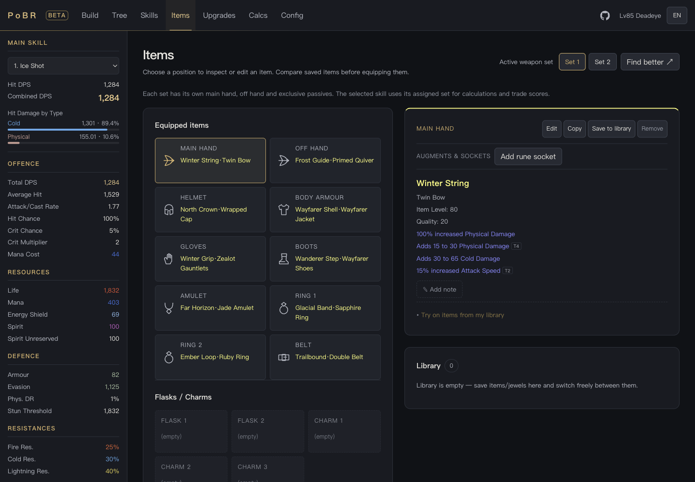
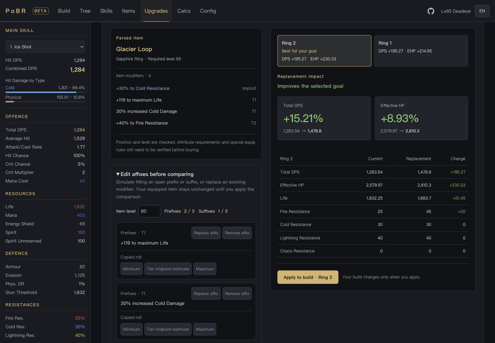
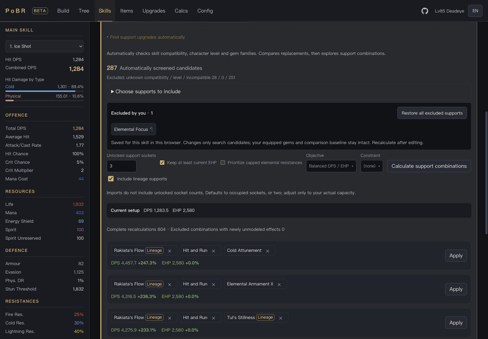
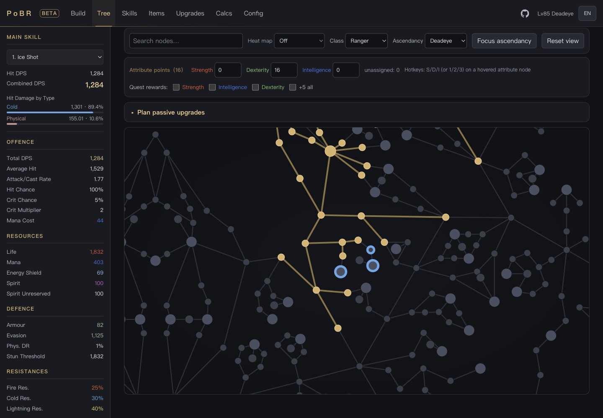

# PoBR — Path of Exile 2 Build Planner

**English** | [简体中文](README.zh-CN.md)

**Compare gear, support gems and passive upgrades before changing your build.**

PoBR (Path of Building in Rust) is an open-source **Path of Exile 2 build planner
that runs in your browser**. Import a PoB2 build code or WeGame share link, inspect
your damage and defences, and preview your next upgrade. Powered by Rust and
WebAssembly, with English, Simplified Chinese and Traditional Chinese interfaces.

**[Try PoBR in your browser](https://pobr-web.pages.dev)** ·
[Release notes](https://github.com/ackness/pobr/releases) ·
[Report a problem](https://github.com/ackness/pobr/issues)

> **Beta:** ready to try, with incomplete game-mechanic coverage. Check unsupported
> effects and combat settings before relying on an upgrade comparison.

## See your next upgrade

| Equipment and live character stats | Compare items and simulate affix tiers |
| --- | --- |
| [](docs/screenshots/equipment.png) | [](docs/screenshots/item-comparison.png) |
| **Filter unwanted supports and compare combinations** | **Preview connected passive upgrades** |
| [](docs/screenshots/support-upgrades.png) | [](docs/screenshots/passive-tree.png) |

Click any image to enlarge. Screenshots use a synthetic demonstration character,
not a build guide.

## What you can do

- **Compare an item before buying.** Paste a complete item copied from the market
  and see its effect on damage per second (DPS), effective hit pool (EHP) and
  resistances across compatible equipment slots.
- **Find support combinations for your skill.** Compare evaluated gem sets,
  exclude supports you do not want to use, and preview level or quality upgrades.
- **Plan your next passive points.** Explore connected routes that include travel
  costs, preview node changes, then apply a plan when you choose.
- **Search the market for your build.** Generate official PoE2 market links with
  relevant affix weights, character-level requirements and a budget filter.
- **Understand the numbers.** Inspect damage breakdowns and modifier sources while
  editing equipment, skills and combat configuration.

## Try it with your build

1. [Open the web app](https://pobr-web.pages.dev) — no desktop installation needed.
2. On **Build**, paste a **PoB2 build code** or a **WeGame PoE2 share link** and
   import it. You can also import a `.build` file or start a new character.
3. Check your main skill, combat configuration and unsupported effects, then use
   **Upgrades**, **Skills** or **Tree** to compare changes.

Edits are saved in your browser. Download a JSON backup to keep a copy or move
devices, or export a PoB2 build code to share your changes. Importing another
build replaces the current one, so download a backup first if you want to keep it.

PoBR is an independent implementation using
[Path of Building for PoE2](https://github.com/PathOfBuildingCommunity/PathOfBuilding-PoE2)
as its calculation reference. It does not yet reproduce every PoB2 mechanic.
Recommendations cover evaluated candidates and modeled effects; market weights
help shortlist items and do not guarantee the best purchase. Compare the complete
item before buying.

## Contribute and follow along

Found a calculation mismatch or an unsupported modifier?
[Open an issue](https://github.com/ackness/pobr/issues/new) with a minimal build
you can share publicly, the relevant item or skill, and expected versus actual
results. UI feedback and translation corrections are welcome too.

For implementation work, start with [the contributor guide](AGENTS.md) or
[adding modifier rules](docs/contributing-mods.md). If PoBR is useful to you,
**star the repository** to bookmark it, or use **Watch → Custom → Releases** for
release notifications.

## For developers

The calculation engine is written in Rust and shared by the WebAssembly app and
CLI. Modifier parsing supports offline precompilation; calculation tracing and
source attribution are exposed through `TraceGraph` and `AttributionReport`.
Stable IDs separate calculation from translated display text, and versioned
JSON snapshots supply game data. PoB2 parity tests guard the recorded regression
baseline; they do not imply complete mechanic coverage.

Calculation runs locally in the browser; WeGame and market HTTP adapters use a
Pages Worker. The desktop application is currently a placeholder. The WASM/JSON
API and CLI are still evolving and may change between releases.

### Run locally

For the web app, follow the [web setup guide](web/README.md) to prepare WASM and
game data and start Vite. To try the CLI, run from the repository root with the
configured Rust toolchain:

```bash
# CLI (binary name: pobr)
cargo run -p pobr-cli -- calculate --base-life 1000 --mod "+50 to maximum Life"
cargo run -p pobr-cli -- decode-code <pob_code>        # PoB build code -> XML
cargo run -p pobr-cli -- parse-mod "20% increased Fire Damage"
```

For changes, select checks for the affected behavior. For example, validate
Build Code changes with:

```bash
./pobr verify build codec
./pobr targets                     # List suites without compiling
./pobr timings build parity        # Compile one suite and report timings
```

Normal local commits use relevant checks. Full gates run in cloud CI: push a
release tag, or request a branch run with `./pobr ci <pushed-ref>`. No duplicate
local full run is required. `./pobr full` remains available for local Rust
validation. The live app deploys from `v0.x` release tags after all CI jobs pass.
See [development workflow](docs/development-workflow.md) for commands and timing.

Rust **edition 2024**; apps and tools inherit the workspace release version.
The seven internal libraries keep independent versions, so application version
bumps do not invalidate the entire library dependency chain.

## Architecture at a glance

Data flow:

```
GGG .dat export
  └─(pobr-data-adapter, offline)→ data/<version>/*.json
       └─(pobr-gamedata, runtime loader)→ calculation layers
```

Calculation pipeline (`pobr-core`):

```
modifier text → parse → ModDb → aggregation queries → calc
  → OutputTable + Breakdown + TraceGraph + AttributionReport
```

Standard stat aggregation: `(base + Σbase) * (1 + Σinc/100) * Π(1 + more/100)`.

Game-data file loading is confined to `pobr-gamedata`; production `pobr-data` /
`pobr-core` do not read data files. Test rule loading requires an explicit test
feature. Apps and tools own network and file input/output; `pobr-data` remains
the bottom project dependency.

Core sources are layered into `model/`, `parse/`, `rules/`, `ingest/`,
`aggregate/`, `calc/`, and `attribute/`. Web's `api/wasmBackend.ts` calls the JSON
contract in `apps/pobr-wasm/src/build_api/`; startup fetches and stages data into
in-memory `GameData` / `BuildData`.

## Workspace layout

14 members: seven libraries in `crates/`, three application entry points in
`apps/`, and four Rust tools in `tools/`. The React/TypeScript `web/` application
and Lua oracle are outside the Cargo workspace.

| Crate | Responsibility |
|-------|----------------|
| `crates/pobr-data` | Pure data definitions (catalog schema: BaseItem/Stat/Mod/SkillGem/PassiveNode…); zero logic, zero I/O; bottom dependency of every crate |
| `crates/pobr-core` | Modifier parsing / storage / aggregation + calculation engine + source-level attribution + source ingestion (item/passive/gem/flask). Zero I/O |
| `crates/pobr-gamedata` | Runtime data loader — the only layer in the data system that touches files; lazy per-domain loading + i18n sidecars |
| `crates/pobr-i18n` | Language pack loading / fallback / display-text mapping (`en-US` canonical + `zh-TW`) |
| `crates/pobr-tree` | Passive tree topology, allocated-node mod collection, radius jewels |
| `crates/pobr-build` | Build state, PoB build code encode/decode, import recognition, `calc_orchestrator/` + `CalcCache`, build comparison. **Home of the parity tests** |
| `crates/pobr-item` | Full-fidelity edit-mode parsing of raw item text + reverse serialization (BuildRaw round-trip) |
| `apps/pobr-cli` | CLI: `calculate` / `parse-mod` / `decode-code` / `encode-code` |
| `apps/pobr-wasm` | Web/WASM API: pure-Rust JSON in/out; wasm-bindgen bindings behind the `wasm` feature |
| `apps/pobr-desktop` | Example calculation and text summary placeholder; no GUI framework yet |
| `tools/pobr-data-adapter` | Data pipeline adapter: GGG `.dat` export → denormalized committed JSON |
| `tools/sync-pob-catalog` | Extracts the stat catalog from PoB core Lua; parity check / diff |
| `tools/lint-i18n` | Language pack completeness check |
| `tools/precompile-mods` | Offline pre-compilation of mod-parser rules / coverage report |

(`tools/pob2-oracle` is a non-workspace pure-Lua wrapper that dumps PoB2-side
calculation breakdowns for per-component comparison.)

## Parity system (regression baseline)

PoB2 compatibility is a hard regression gate, guarded by three complementary
layers:

1. **`crates/pobr-build/tests/parity/ninja_parity.rs`** — walks real PoB2 builds with
   golden stat values, comparing all classes / skills with zero hard-coding;
   `parity_no_regression` asserts the aggregate hit rate never drops below the
   recorded baseline.
2. **golden / dual-run suites** — modules under `tests/parity/` and
   `tests/dualrun/` pin intermediate values and config semantics; Cargo runs
   their aggregate targets `parity.rs` and `dualrun.rs`.
3. **`tools/pob2-oracle`** — when a divergence needs per-component diagnosis,
   dumps the Lua-side calculation breakdown straight from the vendored PoB2.

```bash
cargo test -p pobr-build --test parity -- --nocapture   # parity dashboard
```

`vendor/PathOfBuilding-PoE2/` is a full checkout; verify formulas by reading
the local Lua directly instead of searching online.

## Documentation

- [`AGENTS.md`](AGENTS.md) — concise contributor guide and development entry points.
- [`CLAUDE.md`](CLAUDE.md) — verification tiers, command cheat-sheet, key
  conventions (read before contributing).
- [`agent-docs/`](agent-docs/) — PoE2 (0.5.0) game-mechanics reference in
  Chinese (damage types / resistances / armour, evasion, ES / crit / ailments /
  damage-defence order, …).
- [`web/README.md`](web/README.md) — web frontend.

Early `devs/docs/architecture/00–16` designs and audits are optional local history;
committed documents 18–21 cover feature contracts. Historical snapshots are not
current task lists or fresh-checkout prerequisites. Use code, CLAUDE.md, and
relevant tests for current behavior.

## Conventions

- **Only stable IDs inside the calculation** (`StatId` / `ModName` /
  `SourceId`); display text goes through `pobr-i18n`.
- **Immutable / deterministic**: mutable writes to `Env` are concentrated in
  `perform`; parallelism only fans out over read-only snapshots.
- Changes touching calculation / modifiers / the parser need matching
  integration tests or golden fixtures; changes to crate boundaries,
  aggregation semantics, catalog or parity rules must update the architecture
  docs in the same change.

## References & acknowledgements

- [PathOfBuildingCommunity/PathOfBuilding-PoE2](https://github.com/PathOfBuildingCommunity/PathOfBuilding-PoE2)
  (MIT) — the reference implementation and parity baseline of this project:
  calculation formulas, modifier semantics and specialModList parsing rules are
  verified one-by-one against its Lua implementation (checked out locally under
  `vendor/`, not committed; the pinned commit is recorded in
  `data/<version>/overlay/mod_parser_rules.json::_meta`).
- [poe2db.tw](https://poe2db.tw/) and the PoE2 Wiki — sources for game
  mechanics and text translations.

## License

The code is released under the [MIT](LICENSE) license.

This project is not affiliated with or endorsed by Grinding Gear Games. The
game data under `data/` is derived from Path of Exile 2 client assets and is
copyrighted by Grinding Gear Games; it is included solely for build-calculation
interoperability, in line with Path of Building community practice.
