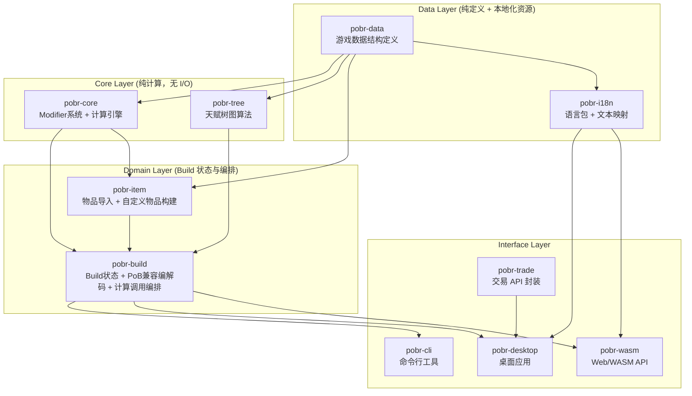

# PoBR 项目架构总览

> **PoBR** = Path of Building in Rust
> 
> 目标：将 PathOfBuilding (Lua) 的核心计算引擎迁移至 Rust，以解决复杂多计算场景下的性能瓶颈，并为后续扩展提供现代化基础。

---

## 1. 为什么要重构

PathOfBuildingCommunity 基于 Lua 开发，在以下场景存在明显性能瓶颈：

- **大规模 Modifier 聚合**：一个典型 Build 的 ModDB 包含数千条 Modifier，每次用户修改配置（如换一件装备、点一个天赋）都需要全量重新聚合 `Sum` / `More` / `Flag`。
- **多技能并行计算**：召唤物、副手技能、触发技能等需要为每个 Actor 独立执行 `calcs.offence` + `calcs.defence`。
- **实时反馈需求**：UI 需要毫秒级更新计算结果，Lua 单线程 + 表查找在当前数据量下难以满足。

Rust 的优势：
- **零成本抽象**：Modifier 聚合可用迭代器 + SIMD 优化。
- **类型安全**：编译期消除大量 Lua 动态类型的运行时错误。
- **并行计算**：`rayon` 可轻松并行化独立 Actor 的计算。
- **可嵌入性**：最终可作为原生库（桌面）、WASM（网页）、或 CLI 工具分发。

---

## 2. 高层架构



### 依赖方向约定

- **只能向下依赖**：`apps/*` → `pobr-build` → `pobr-core` / `pobr-tree` / `pobr-item` → `pobr-data`。
- **`pobr-data` 是最底层**：所有 crate 都依赖它，它本身不依赖任何项目内 crate。
- **本地化不进入计算核心**：`pobr-i18n` 只负责显示文本、语言包和 `stat_id`/文本映射，计算内部永远使用稳定 ID。
- **同层不互相依赖**：`pobr-core` 和 `pobr-tree` 彼此独立，通过 `pobr-build` 或调用方组合。
- **禁止循环依赖**：Rust 编译器会强制阻止，但设计阶段需主动避免。

---

## 3. Crate 职责速查

| Crate | 一句话职责 | 对应原 Lua 模块 | 是否含 I/O |
|-------|-----------|----------------|------------|
| `pobr-data` | 定义所有游戏内数据结构与常量枚举 | `Data.lua`, `Classes/Item.lua`, `Classes/Gem.lua`, `TreeData/` | 否 |
| `pobr-i18n` | 语言包、显示文本、本地化 fallback 与 stat 文本映射 | PoB 原版缺失，PoBR 新增 | 否 |
| `pobr-core` | Modifier 解析、存储、聚合；伤害/防御/技能计算 | `ModParser.lua`, `ModDB.lua`, `ModStore.lua`, `Calc*.lua` | 否 |
| `pobr-tree` | 天赋树拓扑、最短路径、范围珠宝/永恒珠宝效果 | `Classes/PassiveTree.lua`, `TreeData/` | 否 |
| `pobr-item` | 复制物品文本导入、自定义物品创建、affix/roll 编辑 | `Classes/Item.lua`, `Classes/ItemsTab.lua` | 否 |
| `pobr-build` | Build 状态机、PoB Build Code 兼容编解码、计算调用编排 | `Modules/Build.lua`, `Classes/ImportTab.lua`, `Modules/BuildDisplayStats.lua` | 否（文件/剪贴板由 app 处理） |
| `pobr-trade` | 官方 Trade API 封装、查询构建、价格检索 | `Classes/TradeTab.lua` | 仅网络 |
| `apps/pobr-cli` | 命令行入口、fixture/golden 验证入口 | `Launch.lua`, 测试脚本 | 是 |
| `apps/pobr-desktop` | 桌面 GUI | `Modules/Main.lua`, `Classes/*Tab.lua` | 是 |
| `apps/pobr-wasm` | Web/WASM API | PoBR 新增 | 是 |

---

## 4. 与原始 PoB 的映射关系

```
原始 Lua 架构                          Rust 目标架构
─────────────────────────────────    ─────────────────────────────────
Launch.lua                             (Cargo binary entry / wasm-bindgen)
Main.lua (UI Controller)               apps/pobr-desktop (egui/iced/...)
Build.lua (Build State)                pobr-build::Build
CalcPerform.lua (Orchestrator)         pobr-core::calcs::perform
CalcSetup.lua (Env Init)               pobr-core::calcs::setup_env
CalcOffence.lua                        pobr-core::calcs::offence
CalcDefence.lua                        pobr-core::calcs::defence
CalcActiveSkill.lua                    pobr-core::calcs::active_skill
ModParser.lua                          pobr-core::mod_parser
ModDB.lua / ModStore.lua               pobr-core::mod_db
PassiveTree.lua                      pobr-tree::PassiveTree
Data.lua                             pobr-data::game_data
Item.lua / Gem.lua                   pobr-data::item / pobr-data::gem
ImportTab.lua                          pobr-build::import_export
Item.lua / ItemsTab.lua                pobr-item::{raw_text, crafter}
Localization (新增)                    pobr-i18n::{Translator, LanguagePack}
TradeTab.lua                         pobr-trade::api
```

---

## 5. 关键设计原则

1. **计算与状态分离**
   - `pobr-core` 对外暴露确定性计算入口，输入来自 `Build`/`GameData`，输出为结构化结果。
   - `pobr-core` 内部用 `CalculationSession` / `Env` 显式管理阶段性可变状态，避免复刻 Lua 的共享可变表引用。
   - `pobr-build` 持有可变的 `Build` 状态，但将计算委托给 `pobr-core`。

2. **计算核心优先**
   - Modifier 语义、ModDB 聚合和最小计算闭环是最先落地的主线。
   - 物品、天赋、Build Code、自定义物品和多语言都围绕计算输入、验证和展示展开。
   - 每个新机制都需要 unit test、fixture 或 golden case、breakdown 输出。
   - PoB 的全部可计算/可展示/可比较属性是最低兼容目录，PoBR 用生成式 catalog 和 parity matrix 跟踪覆盖率。
   - PoBR 在 PoB 基础上增加 source-level attribution：最终输出能追踪到装备、词条、天赋点、技能宝石、support gem 和配置项的直接/边际/交互贡献。

3. **PoB 兼容作为回归基准**
   - Build Code 采用 PoB 现有格式：XML → deflate → URL-safe Base64。
   - 快捷导入只做字符串识别和解码；剪贴板、文件、URL 读取放在 `apps/*`。
   - 自定义物品和复制物品文本必须保留原始文本区块，便于与 PoB 回归对比。

4. **本地化作为基础能力**
   - 初始支持 `en-US` 和 `zh-TW`。
   - UI 文本、错误文本、stat 描述、物品/技能显示名走 `pobr-i18n`。
   - Modifier 解析先以英文 PoB 兼容为基线；繁体中文导入通过后续反向 stat 映射扩展。

5. **惰性计算与缓存**
   - `pobr-build` 维护一个 `CalculationCache`，当 Build 字段未变化时直接返回缓存结果。
   - 缓存粒度：可按 Actor、按技能、按统计项分层。

6. **并行化就绪**
   - `pobr-core` 的所有计算函数都是 `Send + Sync` 友好的。
   - 多召唤物、多技能、多配置场景可使用 `rayon::join` 或 `par_iter`，但并行边界必须在 Env 初始化和条件写入稳定之后建立。

7. **可测试性**
   - 每个 crate 的纯计算模块都暴露独立的单元测试接口。
   - 提供 fixtures（典型 Build 的序列化快照）用于回归测试。
   - PoB Build Code、raw item text、custom item draft、语言包 fallback 都需要独立回归测试。

---

## 6. 文档导航

| 文档 | 内容 |
|------|------|
| `01-pob-deep-analysis.md` | 原始 PoB 的核心模块深度分析（函数、数据结构、调用关系） |
| `02-crate-design.md` | 各 crate 的详细设计：模块划分、公共 API、内部结构 |
| `03-module-interfaces.md` | crate 间接口契约：关键 trait、数据流、错误处理策略 |
| `04-migration-roadmap.md` | 分阶段迁移计划、里程碑、风险与缓解方案 |
| `05-compatibility-and-i18n.md` | PoB 兼容导入/导出、自定义物品、多语言架构 |
| `06-development-workflow.md` | 开发流程、fixture、CI、工具和文档维护 |
| `07-performance-notes.md` | 预期的性能热点与优化策略（SIMD、缓存、并行） |
| `08-mechanics-primitives.md` | 上限/下限、技能时间、伤害分桶、异常状态、技能等级系数等计算原语 |
| `09-player-facing-calculation.md` | 玩家可见输出、伤害/生存占比、breakdown、build comparison |
| `10-pob-parity-and-attribution.md` | PoB 全量属性覆盖、生成式 catalog、source-level contribution tracing |
| `11-implementation-progress.md` | 当前实现进度、已完成勾选项、正在进行的工程步骤 |
| `12-combat-mechanics-architecture.md` | 战斗机制处理架构：PoB2 机制范式 → pobr `ModDb`/`Env`/`TraceGraph` 适配，敌人 modDB、有效暴击/伤害/异常/防御管线、分阶段落地路线（配套 `agent-docs/*`） |

---

## 7. 术语表

| 术语 | 含义 |
|------|------|
| **Build** | 一个完整的角色配置，包含天赋、装备、技能、配置面板等 |
| **Actor** | 计算中的角色实体，可以是 `player`（玩家）、`enemy`（敌人）、`minion`（召唤物） |
| **Modifier (Mod)** | 影响角色属性的规则，包含名称、类型、值、条件、标签等 |
| **ModDB** | Modifier 数据库，按统计名称索引，支持 `Sum` / `More` / `Flag` 查询 |
| **Env** | 计算环境，包含 Build 引用、配置输入、player/enemy Actor、数据引用等 |
| **Skill Effect** | 技能效果定义，包含等级统计数据、基础标志、技能类型等 |
| **Active Skill** | 由主动宝石 + 支持宝石组合而成的实际技能实例 |
| **Build Code** | PoB 用于导入/导出的 Base64 压缩字符串 |
