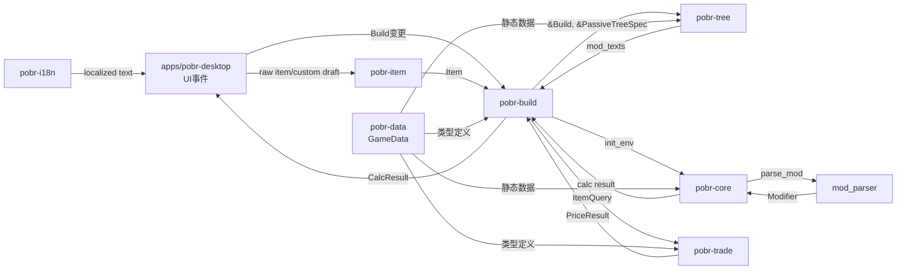

# 模块间接口设计

---

## 1. 接口设计原则

1. **显式计算上下文**：`pobr-core` 对外接收不可变 Build/Data 输入，内部通过 `Env` / `CalculationSession` 显式承载阶段性可变状态。
2. **显式错误**：所有可能失败的计算返回 `Result<T, CalcError>`，不 panic。
3. **零分配热路径**：ModDB 的 `sum`/`more`/`flag` 查询避免堆分配。
4. **兼容格式稳定**：PoB Build Code、XML 字段、raw item text 解析结果都有回归测试保护。
5. **本地化在显示边界完成**：计算和序列化使用稳定 ID，UI/CLI 输出使用 `pobr-i18n`。

---

## 2. crate 间接口契约

### 2.1 pobr-data → 所有 crate

```rust
// pobr-data/src/lib.rs

/// 所有下游 crate 共享的基础类型
pub mod prelude {
    pub use crate::constants::*;
    pub use crate::modifier::{ModName, ModType, ModFlags, KeywordFlags};
    pub use crate::item::Item;
    pub use crate::gem::{Gem, SkillEffect};
    pub use crate::skill::{SkillDefinition, SkillTypes, SkillFlags};
    pub use crate::stat::{StatId, StatDescription};
    pub use crate::game_data::GameData;
}
```

**契约**：`pobr-data` 永不依赖任何项目内 crate，永远是最底层。

---

### 2.2 pobr-core → pobr-build

```rust
// pobr-core/src/lib.rs

/// 计算入口
pub fn perform(env: &mut Env, skip_ehp: bool) -> Result<(), CalcError>;

/// 初始化环境
pub fn init_env<'a>(
    build: &'a Build,
    data: &'a GameData,
    mode: CalcMode,
    spec: &'a PassiveTreeSpec,
) -> Result<Env<'a>, SetupError>;

/// 单次伤害计算（用于工具/测试）
pub fn calc_damage(
    active_skill: &ActiveSkill,
    actor: &Actor,
    cfg: &CalcConfig,
    damage_type: DamageType,
) -> (f64, f64);

/// Modifier 解析
pub mod mod_parser {
    pub fn parse_mod(text: &str) -> Result<Vec<Modifier>, ParseError>;
}

/// ModDB
pub mod mod_db {
    pub struct ModDb { /* ... */ }
    pub struct ModList { /* ... */ }
}
```

**契约**：
- `pobr-core` 不持有 `Build` 所有权，只接受引用。
- `Env` 的生命周期与 `Build` 绑定（`'a`）。
- 计算结果写入 `Env.player.output` / `Env.enemy.output`。
- 错误类型 `CalcError` 实现 `std::error::Error`，可被上游转换。

### 2.2.1 计算原语接口

`pobr-core` 必须先提供机制原语，再扩展具体玩法。上限、下限、最大值提升、技能时间、伤害分桶和异常状态都属于核心接口。

```rust
pub struct GameConstants {
    pub resist_floor: f64,
    pub max_resist_cap: f64,
    pub non_channel_server_frame_time: f64,
    pub dot_dps_cap: f64,
}

pub struct StatBoundary {
    pub total: f64,
    pub final_value: f64,
    pub floor: Option<f64>,
    pub max: Option<f64>,
    pub hard_cap: Option<f64>,
    pub overcap: f64,
    pub missing: f64,
}

pub struct SkillUseTime {
    pub base_use_time: f64,
    pub total_skill_speed: f64,
    pub total_action_speed: f64,
    pub total_use_time_penalty: f64,
    pub tooltip_use_time: f64,
    pub tooltip_rate: f64,
    pub effective_rate: f64,
    pub capped_by_server_tick: bool,
}

pub struct DamageComponent {
    pub source: DamageSource,
    pub kind: DamageKind,
    pub damage_type: DamageType,
    pub min: f64,
    pub max: f64,
    pub tags: SkillTypes,
}

pub struct SkillLevelEffect {
    pub level: u8,
    pub base_damage: Vec<DamageRange>,
    pub attack_damage_of_base: Option<f64>,
    pub attack_speed_of_base: Option<f64>,
    pub added_damage_effectiveness: Option<f64>,
    pub cast_time: Option<f64>,
    pub crit_chance: Option<f64>,
    pub quality_stats: Vec<Modifier>,
}
```

**契约**：
- 抗性输出必须同时包含 total/final/overcap/missing。
- `SkillUseTime` 区分 tooltip rate 与 server-frame capped effective rate。
- `DamageComponent` 先保留分桶，再做 conversion、mitigation、crit、ailment。
- Bleeding 和 Corrupted Blood 使用不同 stat namespace，只共享 DoT/debuff 底层结构。

---

### 2.3 pobr-tree → pobr-build

```rust
// pobr-tree/src/lib.rs

pub struct PassiveTree { /* ... */ }

impl PassiveTree {
    /// 从 TreeData JSON 加载（静态数据，无 I/O）
    pub fn from_json(data: &str) -> Result<Self, TreeError>;
    
    /// 最短路径
    pub fn shortest_path(&self, from: NodeId, to: NodeId) -> Option<Vec<NodeId>>;
    
    /// 应用珠宝后返回新的节点修饰符列表
    pub fn compute_node_mods(&self, spec: &PassiveTreeSpec) -> Vec<(NodeId, Vec<String>)>;
}

/// 范围珠宝效果（纯数据，供 pobr-core 后续解析）
pub struct RadiusJewelEffect {
    pub socket: NodeId,
    pub affected_nodes: Vec<NodeId>,
    pub mod_texts: Vec<String>,
}
```

**契约**：
- `pobr-tree` 只处理拓扑和寻路，不解析 Modifier 文本。
- 返回的 `mod_texts` 由 `pobr-build` 传递给 `pobr-core::mod_parser` 解析。

---

### 2.4 pobr-item → pobr-build / apps

```rust
// pobr-item/src/lib.rs

pub fn parse_raw_item_text(text: &str) -> Result<RawItemParseResult, ItemError>;

pub struct CustomItemDraft {
    // base, rarity, quality, sockets, influence, affixes...
}

impl CustomItemDraft {
    pub fn to_item(&self) -> Result<Item, ItemError>;
    pub fn add_mod(&mut self, section: ItemTextSection, mod_text: String) -> Result<(), ItemError>;
    pub fn set_roll(&mut self, mod_id: EditableModId, value: f64) -> Result<(), ItemError>;
}
```

**契约**：
- `pobr-item` 解析物品文本和维护自定义物品草稿。
- `pobr-item` 可以调用 `pobr-core::mod_parser` 验证英文 modifier 文本。
- `pobr-core` 只接收最终 `Item` / modifier 文本，不依赖 crafting UI 状态。
- 不支持的 raw text 行保留并返回给 UI，保存草稿时不丢失用户输入。

---

### 2.5 pobr-i18n → apps

```rust
// pobr-i18n/src/lib.rs

pub struct Translator { /* ... */ }

impl Translator {
    pub fn new(language: LanguageId) -> Result<Self, I18nError>;
    pub fn text(&self, key: &str) -> Cow<'_, str>;
    pub fn stat_text(&self, stat: StatId) -> Cow<'_, str>;
    pub fn supported_languages() -> Vec<LanguagePack>;
}
```

**契约**：
- 初始语言包：`en-US`, `zh-TW`。
- `en-US` 是 canonical fallback。
- 缺失翻译返回 fallback 文本并记录诊断。
- Build Code、XML、计算输出字段名保持语言无关。

---

### 2.6 pobr-build → apps

```rust
// pobr-build/src/lib.rs

pub struct Build {
    // ... 字段见 02-crate-design.md
}

impl Build {
    pub fn new() -> Self;
    pub fn from_xml(xml: &str) -> Result<Self, BuildError>;
    pub fn to_xml(&self) -> String;
    pub fn from_pob_code(code: &str) -> Result<Self, BuildError>;
    pub fn to_pob_code(&self) -> Result<String, BuildError>;
}

pub enum ImportKind {
    PobCode,
    Xml,
    PobbinUrl,
    RawItemText,
    Unknown,
}

pub fn detect_import(input: &str) -> ImportKind;
pub fn decode_pob_code(code: &str) -> Result<String, BuildCodeError>;
pub fn encode_pob_code(xml: &str) -> Result<String, BuildCodeError>;

/// 计算编排器（带缓存）
pub struct CalcOrchestrator {
    cache: CalcCache,
}

impl CalcOrchestrator {
    pub fn new() -> Self;
    
    /// 计算当前 Build 的完整统计
    /// 内部使用 pobr-core::perform
    pub fn compute(&mut self, build: &Build) -> Result<CalcResult, CalcError>;
    
    /// 仅计算指定技能的伤害
    pub fn compute_skill(&mut self, build: &Build, skill: &ActiveSkill) -> Result<SkillResult, CalcError>;
    
    /// 比较两个 Build 的差异
    pub fn compare(&mut self, base: &Build, variant: &Build) -> Result<ComparisonResult, CalcError>;

    /// 追踪某些输出字段由装备、词条、天赋、技能、配置等来源贡献的比例
    pub fn attribute(&mut self, request: AttributionRequest) -> Result<AttributionReport, CalcError>;
}

/// 计算结果（供 UI 展示）
pub struct CalcResult {
    pub player_output: OutputTable,
    pub enemy_output: OutputTable,
    pub selected_skill: Option<SkillResult>,
    pub display_stats: Vec<DisplayStatValue>,
    pub breakdowns: HashMap<String, BreakdownTable>,
}

pub struct SkillResult {
    pub skill_id: SkillInstanceId,
    pub damage_by_type: Vec<DamageShare>,
    pub hit_dps: f64,
    pub dot_dps: f64,
    pub total_dps: f64,
}

pub struct DamageShare {
    pub damage_type: DamageType,
    pub kind: DamageKind,
    pub value: f64,
    pub percent_of_total: f64,
}

pub struct DisplayStatValue {
    pub id: DisplayStatId,
    pub value: StatValue,
    pub category: DisplayStatCategory,
    pub breakdown_id: Option<String>,
}

pub struct ComparisonResult {
    pub changed_inputs: Vec<InputChange>,
    pub stat_deltas: Vec<StatDelta>,
    pub top_gains: Vec<ContributionDelta>,
    pub top_losses: Vec<ContributionDelta>,
}

pub struct AttributionRequest {
    pub build: BuildSnapshot,
    pub selected_skill: Option<SkillInstanceId>,
    pub outputs: Vec<DisplayStatId>,
    pub group_by: AttributionGroup,
    pub mode: AttributionMode,
}

pub struct AttributionReport {
    pub output: DisplayStatId,
    pub final_value: StatValue,
    pub entries: Vec<AttributionEntry>,
    pub interaction: Option<AttributionEntry>,
}
```

**契约**：
- `Build` 实现了 `Clone + Serialize + Deserialize`，方便 UI 层做 undo/redo。
- `CalcOrchestrator` 是 `pobr-build` 对外的唯一计算接口，隐藏 `pobr-core` 细节。
- 缓存基于 Build 的 content hash，自动失效。
- PoB Build Code 兼容格式为 XML → deflate → URL-safe Base64，语言包和 UI 设置不写入兼容码。
- 剪贴板、文件和网络读取由 app/CLI 完成，`pobr-build` 只处理输入字符串。
- `display_stats` 是 UI 和装备/天赋对比的稳定字段目录，字段定义见 `09-player-facing-calculation.md`。
- `compare` 必须能回答 base build 与 variant build 的伤害、生存、恢复、消耗和需求变化。
- `breakdowns` 必须能解释字段来源，至少覆盖 selected skill damage、resistance、max hit、EHP、recovery 和 cost。
- `attribute` 必须支持直接贡献、边际贡献和交互贡献，详细设计见 `10-pob-parity-and-attribution.md`。
- `DisplayStatCatalog` 的覆盖基线来自 PoB `BuildDisplayStats.lua`、`CalcSections.lua` 和所有 calculation output key，不允许只覆盖手工挑选字段。

---

### 2.7 pobr-trade → apps/pobr-desktop

```rust
// pobr-trade/src/lib.rs

pub struct TradeApiClient {
    // ...
}

impl TradeApiClient {
    pub fn new() -> Self;
    pub async fn search(&self, league: &str, query: &TradeQuery) -> Result<SearchResult, TradeError>;
    pub async fn fetch_prices(&self, league: &str, items: &[ItemQuery]) -> Result<Vec<PriceResult>, TradeError>;
}

/// 从 Build 中的装备生成交易查询
pub fn build_item_queries(build: &Build) -> Vec<ItemQuery>;
```

**契约**：
- 所有网络调用都是 `async`。
- `TradeError` 包含网络超时、API 错误等变体。

---

## 3. 数据流图



---

## 4. 错误处理策略

### 4.1 错误类型层次

```
std::error::Error
├── pobr_data::GameDataError      // 数据加载/反序列化失败
├── pobr_i18n::I18nError          // 语言包缺失/格式错误
├── pobr_core::CalcError          // 计算错误（分阶段）
│   ├── SetupError                // Env 初始化失败
│   ├── ModParseError             // Modifier 解析失败
│   └── ComputeError              // 计算过程中错误
├── pobr_tree::TreeError          // 天赋树数据错误
├── pobr_item::ItemError          // 物品文本解析/自定义物品错误
├── pobr_build::BuildError        // Build 状态/XML/PoB code 错误
└── pobr_trade::TradeError          // 网络/API 错误
```

### 4.2 计算错误的处理

```rust
// pobr-core/src/error.rs
#[derive(Debug, thiserror::Error)]
pub enum CalcError {
    #[error("Environment setup failed: {0}")]
    Setup(#[from] SetupError),
    
    #[error("Modifier parse failed: {text}")]
    ModParse { text: String, source: ParseError },
    
    #[error("Compute error in phase {phase}: {message}")]
    Compute { phase: CalcPhase, message: String },
    
    #[error("Missing required data: {0}")]
    MissingData(String),
}

pub enum CalcPhase {
    Init,
    Attributes,
    LifeMana,
    Defence,
    Offence,
    Triggers,
}
```

---

## 5. 生命周期与所有权

```
apps/pobr-desktop
  │ owns Build
  │
  ├─▶ pobr-build::CalcOrchestrator
  │     │ borrows &Build
  │     │
  │     ├─▶ pobr-core::init_env(&build, ...)
  │     │       │ creates Env<'a> with lifetime of Build
  │     │       │
  │     │       ├─▶ pobr-core::perform(&mut env)
  │     │       │       │ mutably borrows env.player/enemy
  │     │       │       │ writes to env.player.output
  │     │       │       │
  │     │       │       ├─▶ mod_db::sum(...)
  │     │       │       │       │ borrows ModDb
  │     │       │       │       │ returns f64
  │     │       │       │
  │     │       │       ├─▶ offence::calc_offence(env, player, skill)
  │     │       │               │ borrows env, skill
  │     │       │               │ mutates player.output
  │     │       │
  │     │       └─▶ returns ()
  │     │
  │     └─▶ returns CalcResult (cloned from output tables)
  │
  └─▶ UI 展示 CalcResult
```

---

## 6. 并发设计

### 6.1 可并行化点

```rust
// pobr-core/src/calc/perform.rs (parallel feature)
#[cfg(feature = "parallel")]
pub fn perform_parallel(env: &mut Env, skip_ehp: bool) -> Result<(), CalcError> {
    // 阶段 1-2：串行（初始化 + 属性/条件写入，有状态依赖）
    init_and_attribs(env)?;

    // 阶段 3：冻结只读查询上下文，避免并行闭包同时借用 &mut env。
    let query = env.freeze_query_context()?;
    let skills = env.player.active_skills.clone();
    let results: Vec<_> = skills.par_iter()
        .map(|skill| offence::calc_offence_snapshot(&query, skill))
        .collect::<Result<_, _>>()?;

    env.player.output.merge_skill_results(results)?;

    if !skip_ehp {
        defence::build_defence_estimations(env, &mut env.player)?;
    }

    Ok(())
}
```

### 6.2 线程安全约束

- `ModDb` 必须是 `Send + Sync`（查询时不修改内部状态）。
- 并行计算使用冻结后的只读查询快照，不在多个线程同时写 `Env`。
- `Build` 本身不实现 `Sync`（可变状态），但 `&Build` 是 `Sync`。

---

## 7. 测试接口

### 7.1 单元测试

```rust
// pobr-core/src/mod_db/tests.rs
#[test]
fn test_sum_with_conditions() {
    let mut db = ModDb::new();
    db.add_mod(Modifier {
        name: "FireDamage".into(),
        mod_type: ModType::Inc,
        value: 10.0,
        flags: ModFlag::Attack.into(),
        tags: vec![ModTag::Condition { var: "OnFullLife".into() }],
        ..Default::default()
    });
    
    let cfg = CalcConfig {
        flags: ModFlag::Attack.into(),
        conditions: [("OnFullLife".into(), true)].into(),
        ..Default::default()
    };
    
    assert_eq!(db.sum(ModType::Inc, &cfg, &["FireDamage".into()]), 10.0);
}
```

### 7.2 回归测试（Snapshot Testing）

```rust
// pobr-build/src/snapshot.rs
pub fn load_snapshot(path: &str) -> Build;
pub fn save_snapshot(build: &Build, path: &str);

// 测试用例
#[test]
fn test_calc_regression() {
    let build = load_snapshot("tests/fixtures/typical_cyclone.snapshot");
    let result = CalcOrchestrator::new().compute(&build).unwrap();
    
    // 与预存结果比对
    assert_eq!(result.player_output.dps, 1_500_000.0);
    assert_eq!(result.player_output.crit_chance, 0.35);
}
```

### 7.3 兼容与本地化测试

```rust
#[test]
fn test_pob_code_roundtrip() {
    let build = Build::from_xml(include_str!("fixtures/simple.xml")).unwrap();
    let code = build.to_pob_code().unwrap();
    let decoded = Build::from_pob_code(&code).unwrap();
    assert_eq!(decoded.to_xml(), build.to_xml());
}

#[test]
fn test_i18n_fallback() {
    let zh = Translator::new("zh-TW".parse().unwrap()).unwrap();
    assert_eq!(zh.text("build.copy_code"), "複製 BD");
    assert_eq!(zh.text("missing.key"), "missing.key");
}
```

### 7.4 Property Testing

```rust
// 使用 proptest 或 quickcheck
#[test]
fn prop_sum_never_negative_for_positive_mods() {
    // 所有值为正的 INC modifier，sum 结果不应为负
}
```
